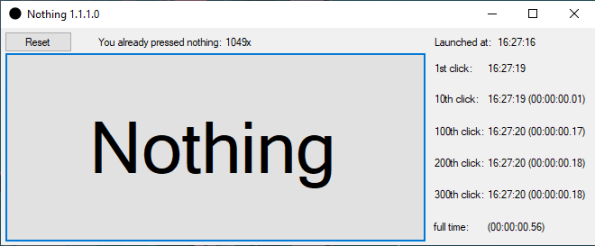
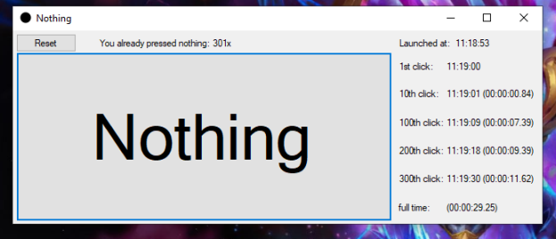

# Nothing
Cliking nothing trying to get the best time?

This was one of my early WindowsForms project
I also wanted to implement that you get time diference of the runs when you reach 1,10,100,200,300 clicks

I have uploaded a commit [1c2b3d0](https://github.com/KoleckOLP/Nothing/commit/1c2b3d0900078cb5323936489555e4d5daed385d) of my early attempt that was absolutely broken resulting in negative diference

than there is a commit [96fe087](https://github.com/KoleckOLP/Nothing/commit/96fe08718c753007be8a91ad441490b9944a1e67) where I tought I fixed it but am not sure

All these commits are old and I am uploading this to tempt me to look at the code and make an actually working implementation.

<h2>let's also have a leaderboard:</h2>
<h3>Tool Assisted</h3>

<pre>
#1. KoleckOLP                           0.56    (custom AHK autoclicker script, version 1.1.1.0)
#2. The Absolute Lord of Darkness,      2.13    (using autoclickers, version 1.1.1.0 unrelesed)
</pre>
<h3>Normal</h3>

<pre>
#1. The Absolute Lord of Darkness,     29.25 (mouse, version 1.1.1.0 unrelesed)
#2. KoleckOLP,                         38.99 (mouse, version 1.1.1.0 unrelesed)
</pre>

You can submit your runs as issues, please include screenshots and method you used.
